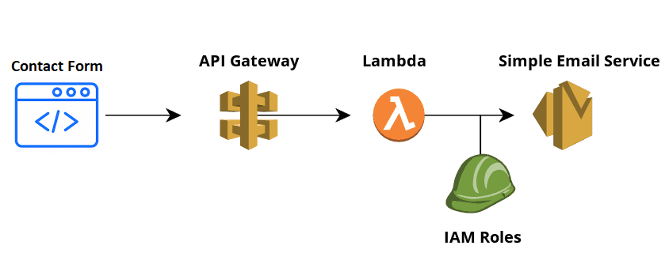

# gatsby-starter-prologue

Gatsby.js V2 starter template based on Prologue by HTML5 UP

For an overview of the project structure please refer to the [Gatsby documentation - Building with Components](https://www.gatsbyjs.org/docs/building-with-components/).


Check online preview [here](https://anubhavsrivastava.github.io/gatsby-starter-prologue/)

## Screenshot


## Install

Make sure that you have the Gatsby CLI program installed:

```sh
npm install --global gatsby-cli
```

And run from your CLI:

```sh
gatsby new <site-name> https://github.com/wilkom2009/kk-portfolio
```

Then you can run it by:

```sh
cd <site-name>
npm install
gatsby develop
```

### Contact form backend



Make sur you follow these tips:
- Create an [AWS Lambda](https://aws.amazon.com/lambda/) function
- Edit the Lambda created's [IAM](https://aws.amazon.com/fr/iam/) role policy in order to send email 
- Create an REST [API Gateway](https://aws.amazon.com/api-gateway/) endpoint
- Register and confirm both sender and receiver email addresses on [AWS Simple Email Service](https://aws.amazon.com/fr/ses/)

### Personalization

Edit `config.js` to put up your details

```javascript
module.exports = {
  siteTitle: 'Wilson KOMLAN | Official web page', // <title>
  ...
  authorName: 'Wilson KOMLAN',
  heading: 'Full stack Developer',
  // social
  socialLinks: [
    {
      icon: 'fa-github',
      name: 'Github',
      url: 'https://github.com/wilkom2009/kk-portfolio',
    }
    ...
  ],
};

```

### Deploying using Github page

`package.json` has a default script that uses `gh-pages` module to publish on Github pages. Simply running `npm run deploy` would publish the site on github pages.

Additionally, it also has [path-prefix](https://www.gatsbyjs.org/docs/path-prefix/) value set for gatsby config in `config.js`. Change `pathPrefix` to relevant path if your gatsby site is hosted on subpath of a domain, `https://theanubhav.com/somePath/`. If you are hosting it as root site, i.e, `https://theanubhav.com/` , remove the pathPrefix configuration.


### Contribution

Suggestions and PRs are welcome!

Please create issue or open PR request for contribution.

### License

[](LICENSE)

refer `LICENSE` file in this repository.
